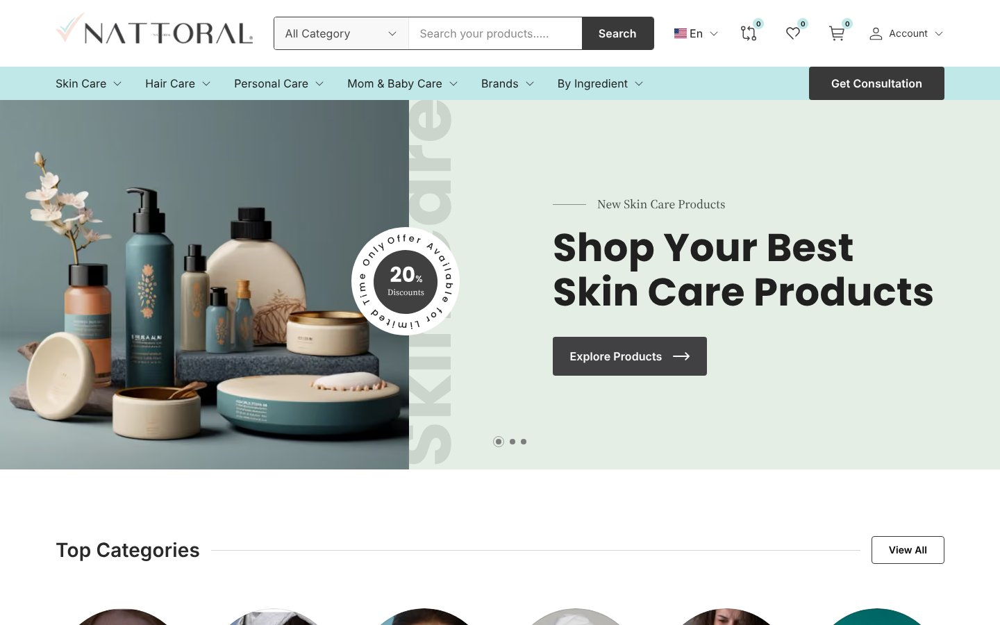

<div align="center">

# Nattoral — Skincare & Beauty E-commerce Website (Next.js + Tailwind CSS)

A modern **skincare e-commerce storefront** — skin care, hair care, personal care and mom & baby products, shop by brand or ingredient, cart, wishlist, compare and a skincare consultation booking flow. Pixel-perfect from Figma, built with Next.js 16, TypeScript and Tailwind CSS v4.

[](https://nattoral-zeta.vercel.app)




</div>

## About

E-commerce storefront for skin care, hair care, personal care and mom & baby products, with a skincare consultation booking flow. Built from the Nattoral Figma design.

## Stack

- [Next.js 16](https://nextjs.org) (App Router, React Server Components) + TypeScript (strict)
- Tailwind CSS v4 with design tokens mapped from the Figma variables (`app/globals.css`)
- Zustand for cart, wishlist and compare state (persisted to `localStorage`)
- Framer Motion for drawers and sheets
- `next/font` (Poppins, Source Serif 4, Open Sans, Plus Jakarta Sans) and `next/image`
- ESLint (flat config) + Prettier

## Getting started

Requirements: Node.js 20.9+ (22 recommended) and npm.

```bash
npm install
npm run dev        # http://localhost:3000
```

Optional environment variable:

| Variable | Purpose |
|---|---|
| `NEXT_PUBLIC_SITE_URL` | Absolute site URL used for canonical links, Open Graph and JSON-LD (defaults to `https://nattoral-zeta.vercel.app`). |

## Scripts

| Script | What it does |
|---|---|
| `npm run dev` | Start the development server |
| `npm run build` | Production build (regenerates the asset manifest first) |
| `npm start` | Serve the production build |
| `npm run lint` | ESLint |
| `npm run typecheck` | Generate route types and run `tsc --noEmit` |
| `npm run format` | Prettier |
| `npm run assets` | Rebuild `lib/asset-manifest.json` from `/public` |

## Folder structure

```
app/
  (shop)/             storefront routes: home, shop, category, product, cart, checkout, …
  globals.css         design tokens (@theme) and base styles
components/
  ui/                 primitives: Button, Field, Choice, ProductCard, Drawer, …
  layout/             Header, Footer, navigation
  sections/           Home page sections
  catalog/            filters, sort, pagination
  product/            gallery, purchase panel, tabs
  cart/               cart drawer, line items, summary
data/                 mock catalog, brands, navigation
lib/                  utilities (assets, catalog query, cart totals, SEO, fonts)
store/                Zustand stores
types/                shared TypeScript types
docs/                 design inventory and QA report
public/               images and icons exported from Figma
```

## Assets

Images and icons are registered in `lib/assets.ts` and rendered through `AssetImage` / `Icon`. A file that is not in `/public` yet renders as a neutral placeholder of the same size, so layouts never shift. Run `npm run assets` (or any build) after adding files.

## Documentation

- `docs/design-inventory.md`: pages, components, tokens and breakpoints extracted from Figma
- `docs/qa-report.md`: pixel QA results and intentional deviations

---

## 👤 Designer & Developer

**Noor Hossain** — UI/UX Designer & Front-End Developer based in Dhaka, Bangladesh. I design in Figma and ship pixel-perfect, responsive, SEO-friendly websites.

[](https://wa.me/8801913264543)
[](https://www.linkedin.com/in/noorxtk/)
[](https://www.behance.net/noorxtk)
[](https://dribbble.com/Noorxtk)

<sub>Keywords: skincare e-commerce website, beauty store website, cosmetics online shop template, Next.js e-commerce, Tailwind CSS store, Figma to code, UI/UX design.</sub>
